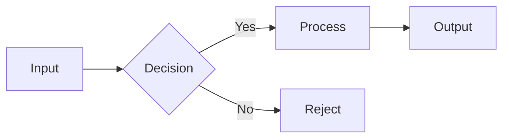

# Diagram Syntax Reference

A collection of ASCII/Unicode diagram patterns for visualizing concepts.

---

## Basic Box Diagram

```
┌─────────────────────────────┐
│                             │
│         CONTENT             │
│                             │
└─────────────────────────────┘
```

### Variations

**Double-line box:**
```
╔═════════════════════════════╗
║                             ║
║         CONTENT             ║
║                             ║
╚═════════════════════════════╝
```

**Round corners:**
```
+─────────────────────────────+
│                             │
│         CONTENT             │
│                             │
+─────────────────────────────+
```

---

## Flow Diagrams

### Linear Flow
```
A ──────► B ──────► C
```

### Flow with Labels
```
┌─────┐    ┌─────┐    ┌─────┐
│  A  │───►│  B  │───►│  C  │
└─────┘    └─────┘    └─────┘
           label
```

### Decision Diamond
```
        ┌────────┐
       ◀│  Yes   │▶
    ┌──│        │──┐
    │  └────────┘  │
    │    No        │
    ▼               ▼
┌───────┐      ┌───────┐
│  Do   │      │Don't  │
│ stuff │      │ do it │
└───────┘      └───────┘
```

### Multi-path Flow
```
                    ┌─────────┐
              ┌────►│ Module  │────┐
              │     │    A    │    │
              │     └─────────┘    │
              │                    ▼
┌────────┐    │              ┌─────────┐
│ Input  │────┤              │ Module  │
└────────┘    │              │    B    │
              │     ┌────────┘         │
              └────►│ Module │◄────────┘
                    │   C    │
                    └────────┘
```

---

## Component Hierarchy

### Tree Structure
```
Root
├── Branch A
│   ├── Leaf A1
│   └── Leaf A2
└── Branch B
    └── Leaf B1
```

### Box Hierarchy
```
┌──────────────────────────────────────────────────────┐
│                    Root Component                     │
├──────────────────────────────────────────────────────┤
│  ┌─────────────┐           ┌─────────────┐          │
│  │  Child A    │           │  Child B    │          │
│  │  (module)   │           │  (module)   │          │
│  ├─────────────┤           ├─────────────┤          │
│  │ ┌─────────┐ │           │ ┌─────────┐ │          │
│  │ │Subchild │ │           │ │Subchild │ │          │
│  │ │    A1   │ │           │ │    B1   │ │          │
│  │ └─────────┘ │           │ └─────────┘ │          │
│  └─────────────┘           └─────────────┘          │
└──────────────────────────────────────────────────────┘
```

---

## Data Flow Diagrams

### Pipeline
```
Input          Step 1          Step 2          Output
──────         ──────          ──────          ──────

┌───┐    ┌───────────┐   ┌───────────┐   ┌───┐
│ X │───►│ transform │──►│  validate │──►│ Y │
└───┘    └───────────┘   └───────────┘   └─────┘
```

### With State
```
┌─────────────────────────────────────────────────────────┐
│                      SYSTEM                              │
│                                                          │
│    Input        Processing        Output                │
│    ┌───┐         ┌─────┐         ┌───┐               │
│    │DATA│────────►│WORK │────────►│RESULT│            │
│    └───┘         │     │         └───┘               │
│                   └─────┘                               │
│                      │                                  │
│                      ▼                                  │
│               ┌───────────┐                            │
│               │  State    │                            │
│               │  {count:3}│                            │
│               └───────────┘                            │
└─────────────────────────────────────────────────────────┘
```

---

## Sequence Diagrams

### Simple Sequence
```
User          Server         Database
  │              │               │
  │──Request────►│               │
  │              │──Query───────► │
  │              │◄──Result────── │
  │◄─Response────│               │
  │              │               │
```

### With Async
```
Caller          Callee          Observer
  │                │                │
  │──Invoke───────►│                │
  │◄─202 Accepted──│                │
  │                │                │
  │                │──Event────────►│
  │                │                │
```

---

## State Diagrams

### Simple State Machine
```
┌─────────┐    event    ┌─────────┐
│ State A │─────────────►│ State B │
└─────────┘              └─────────┘
     ▲                        │
     │         event          │
     └────────────────────────┘
```

### Complex State Machine
```
                    ┌──────────────┐
                    │              │
        ┌──────────►│    START     │──────────┐
        │           │              │          │
        │           └──────────────┘          │
        │                                    │
   no input                              good input
        │                                    ▼
        │                           ┌──────────────┐
        │                           │              │
        │      ┌───────────────────│  PROCESSING  │
        │      │                   │              │
        │      │                   └──────────────┘
        │      │                          │
        │      │      ┌───────────────────┤
        │      ▼      ▼                   │
        │  ┌──────────────┐        error  │
        │  │              │◄─────────────┘
        │  │    ERROR     │
        │  │              │        good input
        │  └──────────────┘        ┌──────────────┐
        │      ▲                   │              │
        │      │                   │    SUCCESS   │
        └──────┘                   │              │
                                   └──────────────┘
```

---

## Entity Relationships

### Simple ER Diagram
```
┌─────────────┐         ┌─────────────┐
│    USER     │         │    ORDER    │
├─────────────┤         ├─────────────┤
│ id          │         │ id          │
│ name        │◄───┐    │ user_id     │
│ email       │     └───│ total       │
└─────────────┘         │ status      │
                        └─────────────┘
```

### More Complex
```
    ┌──────────┐       ┌──────────┐       ┌──────────┐
    │   USER    │       │  ORDER   │       │  ITEM    │
    ├──────────┤       ├──────────┤       ├──────────┤
    │ id (PK)  │───┐   │ id (PK)  │       │ id (PK)  │
    │ name     │   └──►│ user_id  │       │ name     │
    │ email    │       │ status   │       │ price    │
    └──────────┘       └──────────┘       └──────────┘
                           │
                           │
                    ┌──────┴──────┐
                    │ORDER_ITEM   │
                    ├─────────────┤
                    │ order_id(FK)│
                    │ item_id(FK) │
                    │ quantity    │
                    └─────────────┘
```

---

## Module/File Structure

### Directory Tree
```
project/
├── 📁 src/
│   ├── 📁 api/
│   │   ├── 📄 server.ts       # "Main entry, sets up listeners"
│   │   ├── 📁 routes/
│   │   │   ├── 📄 users.ts    # "User endpoints"
│   │   │   └── 📄 orders.ts   # "Order endpoints"
│   │   └── 📁 middleware/
│   │       └── 📄 auth.ts     # "Authentication logic"
│   └── 📁 core/
│       ├── 📄 config.ts       # "Settings loader"
│       └── 📄 logger.ts      # "Logging utility"
└── 📁 tests/
    └── 📄 api.test.ts        # "API tests"
```

### Module Dependencies
```
┌─────────────────────────────────────────┐
│            Module Structure             │
├─────────────────────────────────────────┤
│                                         │
│    ┌─────────────────────────────┐     │
│    │      api/server.ts          │     │
│    │  "The traffic controller"   │     │
│    └──────────────┬──────────────┘     │
│                   │                      │
│         ┌─────────┴─────────┐           │
│         ▼                   ▼           │
│  ┌────────────┐       ┌────────────┐    │
│  │  routes/   │       │ middleware/│    │
│  │  users.ts  │       │  auth.ts   │    │
│  └────────────┘       └────────────┘    │
│         │                   │           │
│         └─────────┬─────────┘           │
│                   ▼                     │
│           ┌────────────┐                │
│           │   core/    │                │
│           │  config.ts │                │
│           └────────────┘                │
│                                         │
└─────────────────────────────────────────┘
```

---

## Layer Architecture

### Layered System
```
┌─────────────────────────────────────────────────────────┐
│                    PRESENTATION                          │
│  "The face of the system - what users see and touch"    │
│  Contains: UI components, views, templates              │
├─────────────────────────────────────────────────────────┤
│                    APPLICATION                           │
│  "The coordinator - directs what happens when"         │
│  Contains: Use cases, application services, commands     │
├─────────────────────────────────────────────────────────┤
│                      DOMAIN                              │
│  "The heart - pure business logic without dependencies" │
│  Contains: Entities, business rules, domain services    │
├─────────────────────────────────────────────────────────┤
│                   INFRASTRUCTURE                         │
│  "The foundation - technical details that support"     │
│  Contains: Database access, external APIs, file I/O      │
└─────────────────────────────────────────────────────────┘
```

### Request/Response Through Layers
```
┌─────────────────────────────────────────────────────────┐
│                                                          │
│   REQUEST                                               │
│       │                                                  │
│       ▼                                                  │
│   ┌────────────────────────────────────────────────┐    │
│   │              Infrastructure Layer              │    │
│   │   "Raw data comes in from external world"      │    │
│   └────────────┬───────────────────────────────────┘    │
│                │                                        │
│                ▼                                        │
│   ┌────────────────────────────────────────────────┐    │
│   │              Application Layer                 │    │
│   │   "Coordinates the response to this request"  │    │
│   └────────────┬───────────────────────────────────┘    │
│                │                                        │
│                ▼                                        │
│   ┌────────────────────────────────────────────────┐    │
│   │                Domain Layer                    │    │
│   │   "Pure business logic - what SHOULD happen"   │    │
│   └────────────┬───────────────────────────────────┘    │
│                │                                        │
│                ▼                                        │
│   ┌────────────────────────────────────────────────┐    │
│   │              Infrastructure Layer              │    │
│   │   "Actually talks to databases, APIs, etc."    │    │
│   └────────────┬───────────────────────────────────┘    │
│                │                                        │
│                ▼                                        │
│   RESPONSE                                              │
│                                                          │
└─────────────────────────────────────────────────────────┘
```

---

## Class/Object Diagrams

### Class Structure
```
┌─────────────────────────────────────────┐
│           <<class>> ClassName            │
├─────────────────────────────────────────┤
│ - privateField: Type                    │
│ # protectedField: Type                  │
│ + publicField: Type                     │
├─────────────────────────────────────────┤
│ + constructor(param: Type): void        │
│ + publicMethod(): ReturnType           │
│ - privateMethod(): void                │
│ # protectedMethod(): void              │
└─────────────────────────────────────────┘
```

### Object Instance
```
┌─────────────────────────────────────────┐
│        instance: ClassName               │
├─────────────────────────────────────────┤
│  field1: "value1"        [from param]   │
│  field2: 42              [computed]      │
│  status: "active"       [default]      │
└─────────────────────────────────────────┘
```

---

## Table Diagrams

### Simple Table
```
┌──────────┬──────────┬──────────┐
│ Column A │ Column B │ Column C │
├──────────┼──────────┼──────────┤
│ Value 1  │ Value 2  │ Value 3  │
│ Value 4  │ Value 5  │ Value 6  │
└──────────┴──────────┴──────────┘
```

### With Keys
```
┌────────────────┬─────────────────────────┐
│     KEY        │       DESCRIPTION      │
├────────────────┼─────────────────────────┤
│ PK = Primary   │ • Unique identifier    │
│ FK = Foreign    │ • Links to other table │
│ UK = Unique     │ • No duplicates         │
│ ND = Not Null   │ • Must have value      │
└────────────────┴─────────────────────────┘
```

---

## Timing Diagram

### Operation Timeline
```
Time ─────────────────────────────────────────►

Component A:  ───┐    ┌────────────┐
                  │    │            │
                  └────┘            └───────

Component B:        └────┐       ┌────────┐
                        │       │        │
                   Wait for    Process   Return
                   data        data      result
```

---

## Call Graph

### Function Call Hierarchy
```
                    ┌─────────────┐
                    │  main()     │
                    │  "Entry"    │
                    └──────┬──────┘
                           │
              ┌────────────┼────────────┐
              │            │            │
              ▼            ▼            ▼
        ┌─────────┐ ┌─────────┐ ┌─────────┐
        │ init()  │ │ parse() │ │ run()   │
        │"Setup" │ │"Convert│ │"Do it" │
        └─────────┘ └────┬────┘ └─────────┘
                         │
                         ▼
                   ┌─────────────┐
                   │ validate() │
                   │ "Check it" │
                   └─────────────┘
```

---

## Icon Legend

Use these icons to mark types:
```
📁  Directory/Folder
📄  File
⚙️  Configuration
🔧  Utility
🧩  Component
🔗  External dependency
⚡  Service/Worker
🔐  Security/Auth
📊  Data/State
🎯  Endpoint/Target
```

---

## Markdown Diagram Extensions

For more complex diagrams, you can render using:

1. **Mermaid** (GitHub, GitLab, VS Code preview)
2. **PlantUML** (standalone tools)
3. **Draw.io** (visual editor, exports to code)

### Mermaid Equivalent


---

## Quick Reference Card

```
┌────────────────────────────────────────────────────────┐
│  DIAGRAM TYPE          │  USE WHEN                     │
│───────────────────────┼───────────────────────────────│
│  Flow                 │  Showing process steps         │
│  Component            │  Showing parts of a system    │
│  Sequence             │  Showing interactions over time│
│  State                │  Showing possible states       │
│  ER                   │  Showing data relationships    │
│  Architecture         │  Showing layers/layers         │
│  Class                │  Showing object structure      │
└────────────────────────────────────────────────────────┘
```

---

**Diagrams.md** - Your reference for building clear visual explanations.